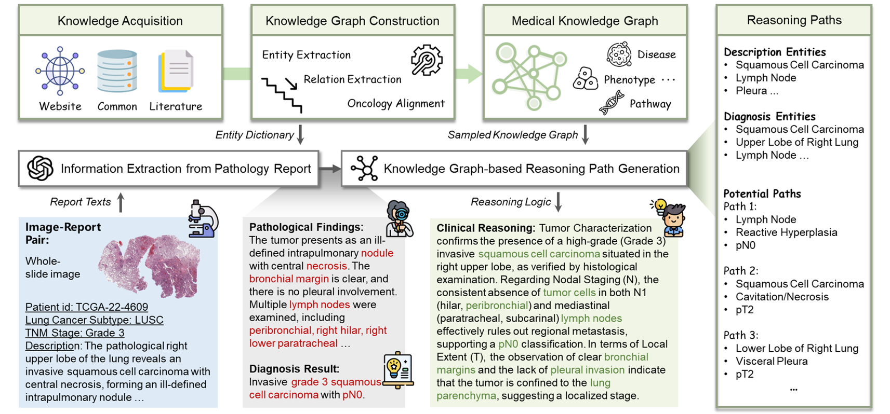
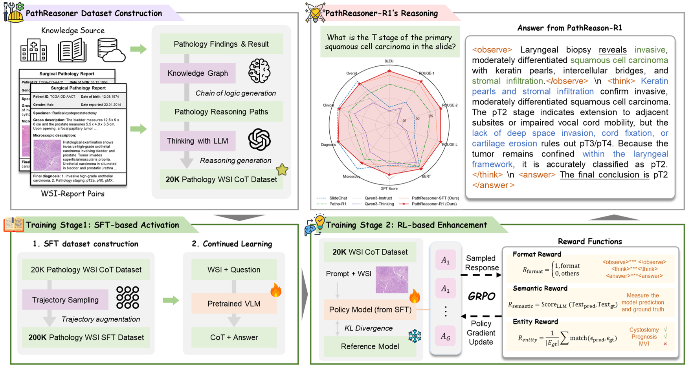

# PathReasoner-R1: Instilling Structured Reasoning into Pathology Vision-Language Model via Knowledge-Guided Policy Optimization

<!-- [](link_to_paper) -->
<!-- [](./datasets) -->
<!-- [](link_to_model) -->
<!-- [](LICENSE) -->

Current Vision-Language Models (VLMs) in computational pathology often function as "black boxes," providing direct diagnosis without verifiable evidence. **PathReasoner-R1** bridges this gap by introducing structured Chain-of-Thought (CoT) reasoning into pathology, transforming models from simple classifiers into transparent clinical reasoners.

---

## 🌟 Key Highlights

*   **🚀 PathReasoner Dataset**: The first large-scale Whole-Slide Image (WSI) reasoning dataset. It contains **20K+ high-quality instruction samples** where findings and clinical reasoning are explicitly aligned with diagnoses.
*   **🧠 Knowledge-Guided Generation**: Unlike traditional unverified distillation, we use **Medical Knowledge Graphs** to generate rigorous, structured pathological reasoning trajectories.
*   **🛡️ PathReasoner-R1 Model**: A novel architecture that synergies **Trajectory-masked SFT** with **Reasoning-oriented Reinforcement Learning (RL)**.
*   **⚖️ Knowledge-Aware Reward Function**: Incorporates a specialized **Entity Reward mechanism** strictly aligned with knowledge graphs to optimize for logical consistency and eliminate hallucinations.
*   **📈 State-of-the-Art Performance**: Achieves SOTA results across multiple benchmarks and image scales, providing clinically grounded and transparent decision-making.

---

## 🖼️ Methodology

### 1. Knowledge-Guided Data Pipeline
We leverage medical knowledge graphs to convert raw pathology findings into structured reasoning paths. This ensures that every diagnosis is backed by a verifiable chain of evidence.
> 
<!-- >  -->

### 2. PathReasoner-R1 Training Strategy
*   **Phase 1: Trajectory-masked SFT**: Instills initial CoT capabilities by focusing on structured reasoning paths.
*   **Phase 2: Knowledge-aware RL**: Uses a multi-granular reward function to ensure the model's logic remains consistent with established medical knowledge.
> 
<!-- >  -->

---

## 📊 Dataset: PathReasoner

**PathReasoner** provides a leap in data quality for CPath:
- **Scalability**: Over 20,000 instruction-following reasoning pairs.
- **Granularity**: Covers multiple image scales (from WSIs to regions of interest).
- **Rigor**: Every sample is aligned with a medical knowledge graph to ensure clinical validity.

---

### 📂 Resources
>🚀 The code, model, and dataset will be released soon.

---


<!-- ### Quick Inference -->
<!-- To run a quick inference with PathReasoner-R1, use the code in [`./src/demo.py`](./src/demo.py) -->

<!-- ## 🛠️ Installation & Setup -->

<!-- ### Environment
```bash
git clone https://github.com/your-username/PathReasoner-R1.git
cd PathReasoner-R1
conda create -n pathr1 python=3.10
pip install -r requirements.txt
``` -->

<!-- ### Quick Inference -->
<!-- To run a quick inference with PathReasoner-R1, use the code in [`./src/demo.py`](./src/demo.py) -->

<!-- --- -->

<!-- ## 🚀 Training Pipeline

### Step 1: Supervised Fine-Tuning (SFT)
```bash
python train_sft.py \
    --model_name_or_path base_vlm_model \
    --data_path ./data/PathReasoner_SFT.json \
    --output_dir ./checkpoints/sft_model
```

### Step 2: Policy Optimization (RL)
Our Entity Reward mechanism ensures the model doesn't just "guess" the right answer but follows the correct medical logic.
```bash
python train_rl.py \
    --sft_model_path ./checkpoints/sft_model \
    --reward_type knowledge_aware_entity \
    --kg_path ./knowledge_graphs/pathology_kg.json
```

--- -->

<!-- ## 📜 Citation

If you use **PathReasoner-R1** or the **PathReasoner Dataset** in your research, please cite:

```bibtex
@article{pathreasoner2024,
  title={PathReasoner-R1: Instilling Structured Reasoning into Pathology Vision-Language Model via Knowledge-Guided Policy Optimization},
  author={Your Name and Collaborators},
  journal={arXiv preprint},
  year={2024}
}
```

--- -->
## 📕KG-related repos used in PathReasoner:
* PrimeKG (Medical KG): [https://dataverse.harvard.edu/dataset.xhtml?persistentId=doi:10.7910/DVN/IXA7BM](https://dataverse.harvard.edu/dataset.xhtml?persistentId=doi:10.7910/DVN/IXA7BM)
* PathoGraph (Pathology KG): [https://github.com/Peiliang/PathoML](https://github.com/Peiliang/PathoML)
* MedResearch-R1 （Trajectory masking）: [https://github.com/AQ-MedAI/MedResearcher-R1](https://github.com/AQ-MedAI/MedResearcher-R1)
* MedReason（Entity extraction）: [https://github.com/UCSC-VLAA/MedReason](https://github.com/UCSC-VLAA/MedReason)

---

## 🤝 License & Disclaimer
This project is licensed under the **Apache 2.0 License**. 
**Disclaimer**: This model is for research purposes only. It is not a substitute for professional medical advice, diagnosis, or treatment. Always consult with a qualified pathologist for clinical decisions.